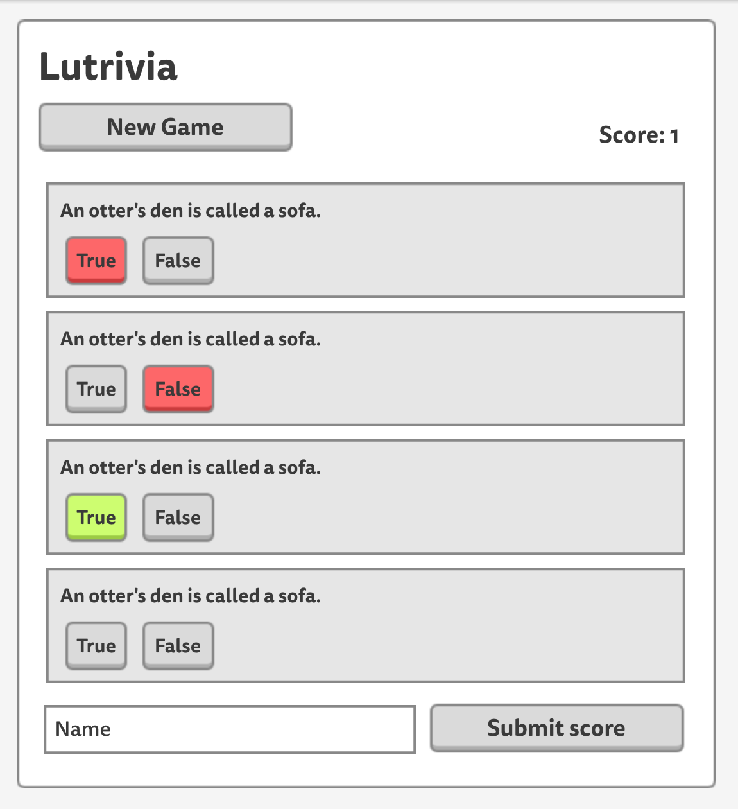

# Lutrivia

You are going to be building Lutrivia! This is intended to be a a bare bones project that is designed to have you practice passing props down from the App component to your other components.

1. Plan a component hierarcy
    * Plan where to put state
2. Build a static version
    * No events yet
3. Add inverse data flow 
    * So that we can respond to events (the user doing things)

### User Stories
* As a user, I can see a list of 4 questions
* As a user, I can select an answer
* As a user, I can see if my answer was right or wrong
* As a user, I can see my score increase as I get answers correct
* As a user, I can click the new game button to reset the 4 questions
* (Ignore the name and submit score buttons)

## Wireframe

## Server
* Run `json-server --watch db.json` in the root folder of the project
* Use fetch to get the question data from `http://localhost:3000/questions`

## Component hierarchy

- App
  - ???
